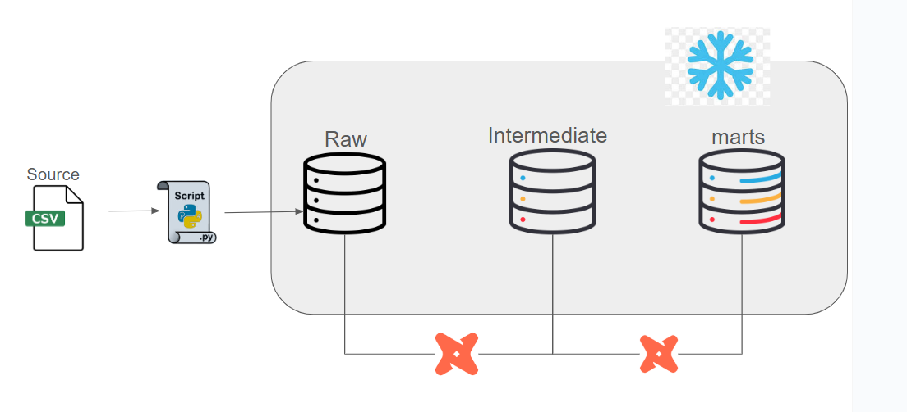

# dbt_project

This dbt project is designed to transform and model data in a Snowflake data warehouse, following the medallion architecture (raw → intermediate → marts). It includes data loading from CSV files, data transformation models, and data quality tests.

---

## Project Structure

```bash
.
dbt_project/
├── datasets/            # Source CSV data files
├── models/
│   ├── raw/             # Base tables (ingested from CSVs)
│   ├── intermediate/    # Cleansed and transformed data
│   └── marts/           # Final analytics-ready marts (facts and dims)
├── macros/              # Custom Jinja macros
├── tests/               # Data quality tests
├── extract_load.py      # Python script to load data into Snowflake
├── dbt_project.yml      # Project configuration
└── README.md
```

---

## Architecture



---

## Getting Started

### 1. Prerequisites

- Python 3.x
- dbt Core
- Snowflake account

### 2. Clone the Repository

```bash
git clone <your-repo-url>
cd dbt_project
```

### 3. Install Dependencies

Install the required Python packages:

```bash
pip install -r requirements.txt
```

### 4. Set up Environment Variables

Create a `.env` file in the project root and add your Snowflake credentials:

```
SNOWFLAKE_USER=<your_user>
SNOWFLAKE_PASS=<your_password>
SNOWFLAKE_ACCOUNT=<your_account>
SNOWFLAKE_WAREHOUSE=<your_warehouse>
SNOWFLAKE_DATABASE=<your_database>
SNOWFLAKE_SCHEMA=raw
SNOWFLAKE_ROLE=<your_role>
```

### 5. Set up dbt Profile

Edit your `~/.dbt/profiles.yml` file to include a profile for this project:

```yaml
dbt_project:
  target: dev
  outputs:
    dev:
      type: snowflake
      account: <your_account>
      user: <your_user>
      password: <your_password>
      role: <your_role>
      database: <your_database>
      warehouse: <your_warehouse>
      schema: public
      threads: 4
```

### 6. Load Raw Data

Run the `extract_load.py` script to load the CSV data from the `datasets` directory into the `raw` schema in Snowflake:

```bash
python extract_load.py
```

### 7. Run dbt Models

Execute the dbt models to transform the data:

```bash
dbt run
```

### 8. Test the Data

Run the dbt tests to ensure data quality:

```bash
dbt test
```

---

## Models

- **Raw:** The `raw` layer contains the initial data loaded from the CSV files. The tables in this layer are defined in `models/raw/source.yml`.
- **Intermediate:** The `intermediate` layer contains cleansed and transformed data from the `raw` layer. These models perform operations like data type casting, cleaning, and joining datasets.
- **Marts:** The `marts` layer provides the final, analytics-ready data models. This layer includes fact and dimension tables, such as `fact_sales`, `dim_customers`, and `dim_products`.

---

## Datasets

The following CSV files are located in the `datasets/` directory and are loaded into the `raw` schema:

- `CUST_AZ12.csv`
- `cust_info.csv`
- `LOC_A101.csv`
- `prd_info.csv`
- `PX_CAT_G1V2.csv`
- `sales_details.csv`
